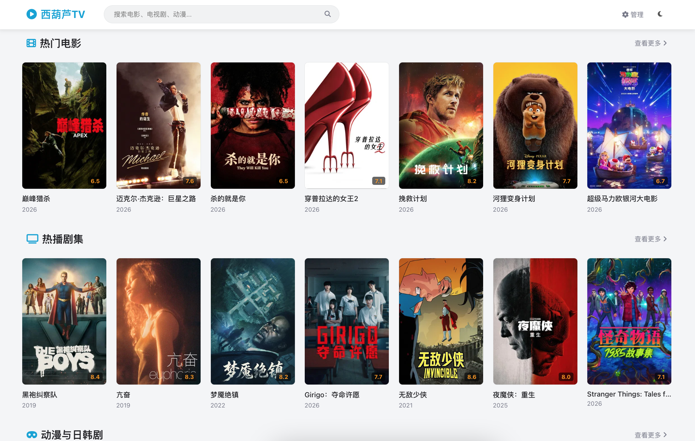
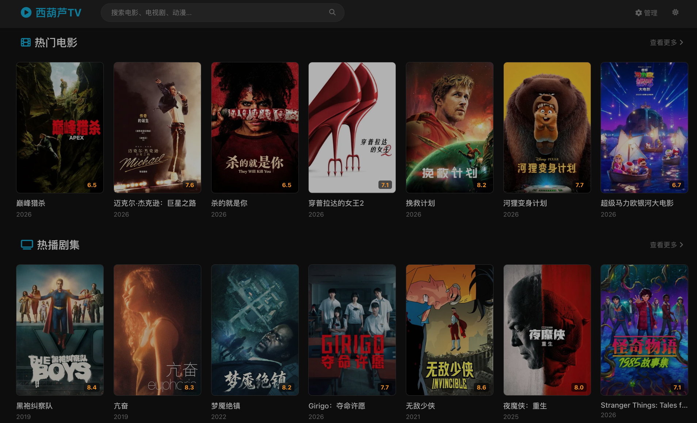
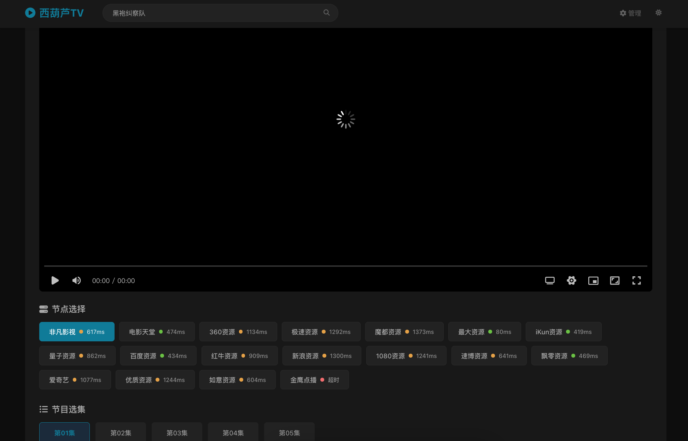

# ✨ 西葫芦 TV (Xihulu TV)

基于 [冬瓜 TV](https://github.com/Minerchu/dongguaTV) , 使用AI进行重构，
保留了原版核心的"TMDb 海报刮削 + 海量高可用资源聚合 API"引擎，彻底革新了由内而外的技术栈、操作界面与数据安全管理。

---

## 📸 截图预览

| 亮色模式 | 暗色模式 |
|:---:|:---:|
|  |  |

| 播放界面 |
|:---:|
|  |

---

## ✨ 功能特性

本项目在原版基础上进行了以下改进：

1. **黑暗/明亮模式切换** - 支持一键切换主题，自动记忆用户偏好，也可跟随系统设置
2. **移动设备体验优化** - 针对性优化移动端交互，横向滑动更流畅，布局更紧凑
3. **可回退支持** - 封面加载失败时自动回退，支持 TMDB 补全海报，骨架屏加载提升体验

---

## 🚀 部署指南 (基于 Docker)

> 推荐使用 Docker 直接一键部署

### 1. Docker 方式
```bash
git clone https://github.com/582033/xihuluTV.git
cd xihuluTV

#修改ADMIN_PASSWORD=你的管理密码

# 一键部署
docker compose up -d --build
```

### 2. 源码方式
```bash
git clone https://github.com/582033/xihuluTV.git
cd xihuluTV

#安装依赖
npm install

# 启动服务
npm start
```

### 3. 访问应用
- **前台地址**: `http://localhost:3000`
- **后台控制面板**: `http://localhost:3000/admin.html`
- **登录凭证**: 取决于您在如上环境预设的 `ADMIN_PASSWORD` (如果没有填写，默认缺省密码为 `admin`)。

⚠️ **注意：首次登录后台后，请务必前往管理后台配置您的专属 TMDB ApiKey 及反代域名！否则首页内容无法展示！**


### 4. 使用 tmdb-proxy 对 TMDB 进行反代(可选)
- **如果发现 tmdb的 影片图片无法加载，可以尝试使用 tmdb-proxy 进行反代**
[tmdb-proxy](https://github.com/582033/tmdb-proxy)


## 📝 免责声明

本项目仅供学习研究与代码重构练习使用。本程序自身不提供、不存储任何影视源影片文件。
所有数据搜集依赖于开放网络检索及聚合分发，使用者通过设定所产生的任何行为牵涉版权或法律责任，均由使用者自行判断与承担。请自觉遵守当地法律法规！

---

## 📄 开源协议

MIT License
